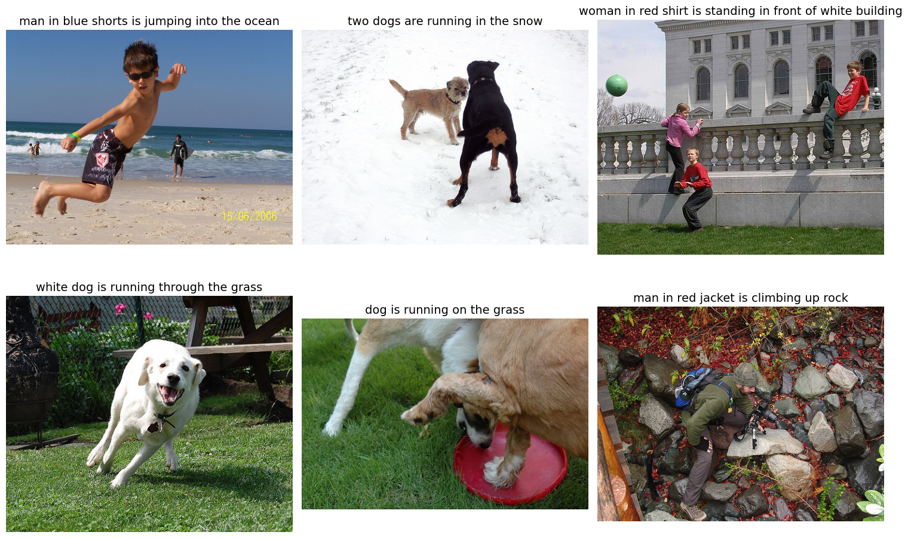
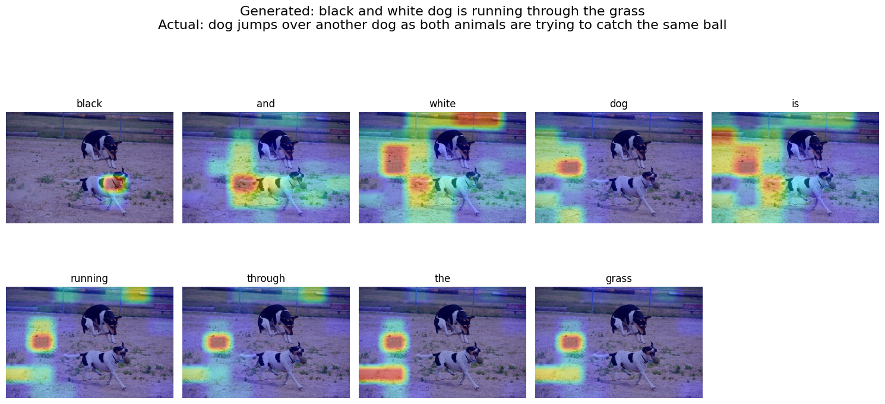
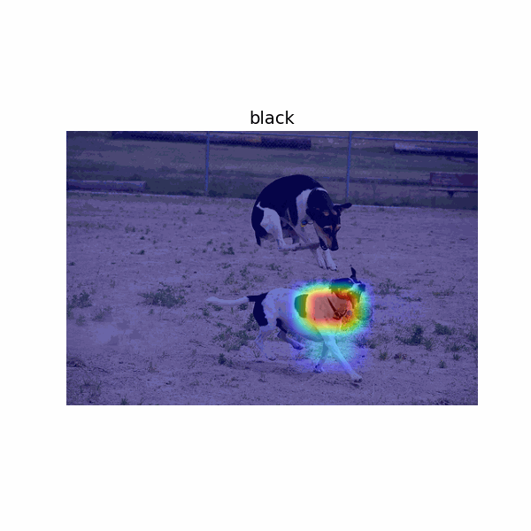

# 🖼️ Image Captioning using PyTorch

## 🚀 Overview
This project implements an **Image Captioning** using Deep Learning.  
It generates natural language descriptions for input images using CNN + Attention + LSTM.

---

## 🧠 Architecture
Image → CNN Encoder → Feature Map → Attention → LSTM Decoder → Caption

---

## 📸 Demo & Results

### 🔹 Sample Predictions



---

## 🎥 Attention Visualization



### 🔥 Model Focus per Word (GIF)



👉 This GIF shows:
- Each word generated step-by-step
- Corresponding attention heatmap on the image

---

## 📂 Dataset
- Flickr8k Dataset
- 8000 images with 5 captions each

---

## ⚙️ Installation

```bash
pip install torch torchvision nltk pillow matplotlib tqdm
```

---

## 🏗️ Pipeline

1. Data preprocessing (clean + tokenize)
2. Vocabulary building
3. CNN Encoder (ResNet)
4. Attention + LSTM Decoder
5. Training (CrossEntropyLoss)
6. Inference (caption generation)


---

## 💾 Model Saving

```python
torch.save(model.state_dict(), "model.pth")
```

---

## 📊 Evaluation

- BLEU Score - Not Done
- Measures caption quality

---

## ⚠️ Limitations

- Sequential decoding (slow)
- Limited long-range dependency

---

## 🚀 Future Work

- Transformer-based captioning
- Beam search decoding
- CIDEr / METEOR metrics

---

## 📁 Project Structure

```
project/
│
├── Images/
├── assets/
│   ├── sample1.jpg
│   ├── sample2.jpg
│   ├── attention.gif
│
├── notebook.ipynb
├── README.md
```

---

## 👨‍💻 Author

**Vrajkumar Patel**
